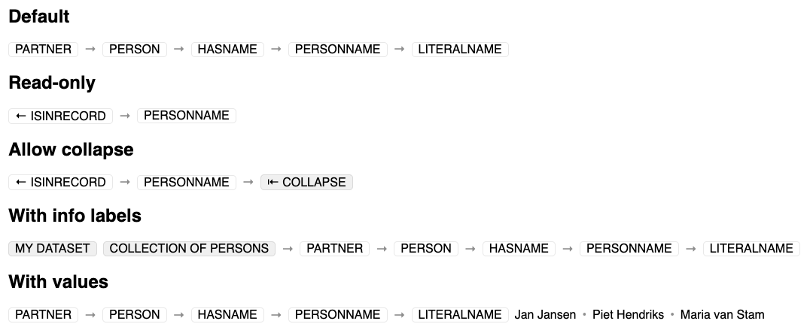

# Property Path (React)

A React input component for defining a property path. Requires React 19.

Install the package using:
`npm install @knaw-huc/property-path-react`

Build the package using:
`npm run build`

Or run the example project in the `example` folder using:
`npm run dev`

| Parameter                    | Value type                                                                    | Required? |                                                                                                                                        |
|------------------------------|-------------------------------------------------------------------------------|-----------|----------------------------------------------------------------------------------------------------------------------------------------|
| `propertyPath`               | `(C \| P \| null)[]`                                                          | ✓         | The property path consisting of collections `C` and properties `P`                                                                     |
| `startCollection`            | `C`                                                                           | ✓         | The collection from which the property path starts                                                                                     |
| `stopProperty`               | `P`                                                                           |           | The property which signals an end to the property path                                                                                 |
| `infoLabels`                 | `string[]`                                                                    |           | Information labels to start the property path with                                                                                     |
| `values`                     | `string[]`                                                                    |           | Values to end the property path with                                                                                                   |
| `getCollectionOptions`       | `(collection: C, property: P, searchValue: string) => C[]`                    | ✓         | For a collection input in the path, following the previous `collection` and `property`, what are the possible next collection options? |
| `getPropertyOptions`         | `(collection: C, searchValue: string) => P[]`                                 | ✓         | For a property input in the path, following the previous `collection`, what are the possible next property options?                    |
| `getCollectionLabel`         | `(collection: C) => string`                                                   |           | Obtain a human-readable label for the given `collection`                                                                               |
| `getPropertyLabel`           | `(collection: C, property: P) => string`                                      |           | Obtain a human-readable label for the given `property` from the given `collection`                                                     |
| `getCollectionOption`        | `(collection: C) => ReactNode`                                                |           | Render a collection input option for the given `collection`                                                                            |
| `getPropertyOption`          | `(collection: C, property: P) => ReactNode`                                   |           | Render a property input option for the given `collection` and the given `property`                                                     |
| `className`                  | `string`                                                                      |           | Give the property path the given classes                                                                                               |
| `readOnly`                   | `boolean`                                                                     |           | Make the property path readonly                                                                                                        |
| `allowCollapse`              | `boolean`                                                                     |           | Allow the user to collapse the property path                                                                                           |
| `startCollapsed`             | `boolean`                                                                     |           | Should the property path be rendered collapsed initially                                                                               |
| `doCollapseButtonOverride`   | `ReactNode`                                                                   |           | Override the rendering of the collapse button                                                                                          |
| `undoCollapseButtonOverride` | `ReactNode`                                                                   |           | Override the rendering of the expand (undo collapse) button                                                                            |
| `buttons`                    | `[ReactNode, string, () => void][]`                                           |           | Add additional buttons to the property path with their rendering `ReactNode`, their label `string` and their callable `() => void`     |
| `onChange`                   | `(newProperty: (C \| P \| null)[], prevProperty: (C \| P \| null)[]) => void` |           | The callback to handle changes to the property path made by the user                                                                   | 
